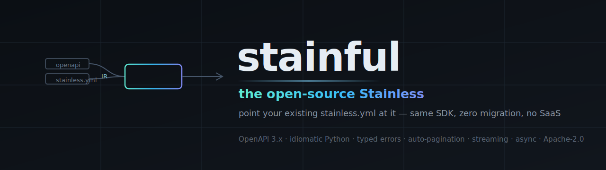

<p align="center">
  
</p>

<p align="center">
  <a href="LICENSE"></a>
  
  <a href="https://github.com/stainlu/stainful/actions/workflows/ci.yml"></a>
  
  
  <a href="CONTRIBUTING.md"></a>
</p>

<p align="center">
  <b>Point your existing <code>stainless.yml</code> at it and get the same SDK.</b><br>
  Zero migration. No SaaS. No upsell. No lock-in.
</p>

---

Stainless steel doesn't rust because of what's *added* to it. **stainful** is the
opposite bet: the quality that makes an SDK feel hand-crafted shouldn't live behind
a paywall — it should be in the open, in your CI, in a repo you own.

[Stainless](https://www.stainless.com/) generates the official OpenAI and Anthropic
SDKs. That's the quality bar. **stainful is that workflow — open source, for Python —
and it reads the Stainless config you already have, unchanged.**

## What is stainful?

stainful takes an **OpenAPI 3.x spec** + your **`stainless.yml`** and emits an
idiomatic Python SDK that a senior engineer would recognize as hand-written:

- 🧬 **Typed everything** — pydantic v2 models, real discriminated unions from `oneOf`
- 🔁 **Auto-pagination** — `for item in client.things.list(): ...`
- 🛡️ **Typed error hierarchy** — `except RateLimitError` not `if status == 429`
- 🔄 **Retries** with exponential backoff + jitter, `Retry-After`, idempotency keys
- 📡 **Streaming** — typed SSE events, sync **and** async, identical surface
- 🎯 **3-valued cardinality** — `required` ≠ `optional` ≠ `nullable`, never conflated
- 🧭 **Domain-shaped clients** — `client.chat.completions.create(...)`, not flat stubs
- ⚡ **Sync + async parity** generated from one model
- 🚫 **No hosted service.** It runs on your machine and in your CI. The repo *is* the product.

## The gap it closes

Free generators emit an HTTP transport layer. Paid platforms emit an *SDK* — but
gate the engine behind a SaaS. stainful closes that gap in the open.

```python
# OpenAPI Generator (free, mechanical)            # stainful (free, idiomatic)
api = DefaultApi(ApiClient(cfg))                   client = OnebusawaySDK()
resp = api.agency_agency_id_json_get(id)           agency = client.agency.retrieve(id)
# resp: loosely-typed, no retries, no errors,      # typed model, retries, typed errors,
#       you write the pagination loop              # auto-pagination, request id, async twin
```

## Quickstart

```bash
# install (uv recommended)
git clone https://github.com/stainlu/stainful && cd stainful
uv venv && uv pip install -e ".[dev,generated-runtime]"

# generate an SDK from a spec + your existing Stainless config
uv run stainful generate \
  --spec   openapi.yml \
  --config stainless.yml \
  --out    ./sdk
```

```python
from onebusaway import OnebusawaySDK          # ← same import as the Stainless-generated SDK

client = OnebusawaySDK(api_key="...")          # or $ONEBUSAWAY_API_KEY
agency = client.agency.retrieve("1")           # typed, retried, idiomatic
print(agency.data.entry.name)
```

## How it works

```
 stainless.yml ─┐                                                  ┌─► idiomatic Python SDK
 (Stainless     │                                                  │   (httpx + pydantic v2)
  config fmt)   ▼                                                   │
   config.loader ──┐                                                │
                   ├─► ir.builder ─► IR ──► emit.python ────────────┤
   openapi.loader ─┘   (the moat)                                   └─► vendored runtime
   + resolver          rich, language-agnostic                          (retries, errors,
   ($ref / allOf)      3-valued cardinality                              pagination, SSE)
```

The **IR** is the moat: a fully-resolved, language-agnostic semantic model where
`allOf` is merged, `oneOf` is a real tagged union, and cardinality is 3-valued.
The emitter is a thin renderer over a hand-written runtime — idiomatic quality
lives in human-written code, not per-endpoint templates. See [`DESIGN.md`](DESIGN.md).

## How it compares

|                              | OpenAPI Generator | Fern | Stainless | **stainful** |
|------------------------------|:-:|:-:|:-:|:-:|
| Open source                  | ✅ | ✅ | ❌ | ✅ |
| No SaaS / no upsell          | ✅ | ⚠️ open-core | ❌ | ✅ |
| Reads your `stainless.yml`   | ❌ | ❌ *(competes with Stainless)* | ✅ *(their SaaS)* | ✅ **drop-in** |
| Output *shaped like* Stainless | ❌ | ❌ | ✅ | ✅ |
| Idiomatic (pagination/errors/streaming) | ❌ mechanical | ✅ | ✅ | ✅ |

Not "an OSS SDK generator" (Fern owns that). **stainful is _the open-source
Stainless_** — for everyone priced out of, or locked into, Stainless, who doesn't
want to rewrite into someone else's world. Full analysis in [`RESEARCH.md`](RESEARCH.md).

## Navigating the repo

| Path | What |
|---|---|
| `src/stainful/config/`  | `stainless.yml`-compatible loader (position-aware diagnostics) |
| `src/stainful/openapi/` | OpenAPI 3.x loader + cycle-safe `$ref`/`allOf` resolver |
| `src/stainful/ir/`      | **the moat** — rich language-agnostic IR |
| `src/stainful/emit/`    | Python emitter (thin renderer) |
| `src/stainful/runtime/` | hand-written SDK runtime, vendored into output |
| `tests/fixtures/`       | OneBusAway (REST/allOf) + chat (streaming/unions) conformance |
| [`RESEARCH.md`](RESEARCH.md) | strategy & competitive analysis |
| [`DESIGN.md`](DESIGN.md)     | architecture & IR design |

## Status

**v1 is complete and green** — slices 1–6, 37 tests, ruff clean. Verified against
the *real* Stainless-generated `OneBusAway/python-sdk`: client class, package,
env var, and call shape all match. The drop-in symbol contract holds.

**v1.1 polish backlog** (working, not yet 1:1 with Stainless — tracked in `DESIGN.md §7`):
`to_json()/.to_dict()` helpers · rich `APIResponse` object · per-file model modules ·
typed error-body models · `custom_casings`.

**Roadmap:** v1 Python SDK → v2 MCP server (same IR) → v3 second language → v4 docs.
Depth over breadth: one excellent language, then prove the IR is language-agnostic.

## Contributing

PRs welcome — see [`CONTRIBUTING.md`](CONTRIBUTING.md) and our
[Code of Conduct](CODE_OF_CONDUCT.md). Good first issues: the v1.1 backlog above,
each one self-contained behind the IR boundary.

```bash
uv run pytest -q          # 37 tests
uv run ruff check src tests
```

## License

[Apache-2.0](LICENSE). The engine is permanently, fully-capable open source —
commercial offerings (if ever) only wrap it with operated convenience, never gate
capability. The repo is the whole product.
