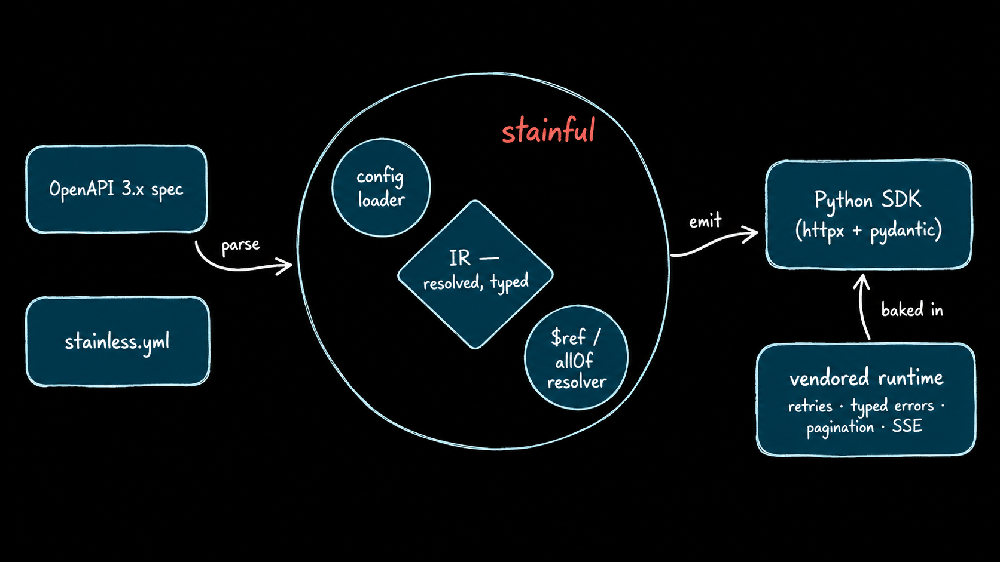

<h1 align="center">stainful</h1>

<p align="center">
  
</p>

<p align="center">
  <a href="LICENSE"></a>
  
  <a href="https://github.com/stainlu/stainful/actions/workflows/ci.yml"></a>
  
  <a href="CONTRIBUTING.md"></a>
</p>

<p align="center">
  <b>Generate an idiomatic Python SDK from an OpenAPI spec and a <code>stainless.yml</code>.</b><br>
  Open source. Runs locally and in CI. No account, no hosted service.
</p>

---

stainful turns an **OpenAPI 3.x spec** and a **Stainless config** into a Python SDK
that reads like it was written by hand — typed models, real error classes,
retries, auto-pagination, streaming, sync **and** async. It reuses the
`stainless.yml` format, so if you already have one, you can point stainful at it
as-is.

## Features

- 🧬 **Typed everything** — pydantic v2 models, real discriminated unions from `oneOf`
- 🔁 **Auto-pagination** — `for item in client.things.list(): ...`
- 🛡️ **Typed errors** — `except RateLimitError:` instead of checking status codes
- 🔄 **Resilient** — retries with exponential backoff + jitter, `Retry-After`, idempotency keys
- 📡 **Streaming** — typed Server-Sent Events, identical surface in sync and async
- 🎯 **Precise optionality** — `required`, `optional`, and `nullable` stay distinct
- 🧭 **Domain-shaped clients** — `client.chat.completions.create(...)`, not flat stubs
- ⚡ **Sync + async** generated from one model
- 📦 **Self-contained output** — the generated SDK depends only on `httpx` + `pydantic`

## Quickstart

```bash
git clone https://github.com/stainlu/stainful && cd stainful
uv venv && uv pip install -e ".[dev,generated-runtime]"

uv run stainful generate \
  --spec   openapi.yml \
  --config stainless.yml \
  --out    ./sdk
```

The generated SDK feels like an official client:

```python
from onebusaway import OnebusawaySDK

client = OnebusawaySDK(api_key="...")          # or set ONEBUSAWAY_API_KEY
agency = client.agency.retrieve("1")           # typed, retried, idiomatic
print(agency.data.entry.name)
```

Streaming, async, and typed errors work the way you'd expect:

```python
import asyncio
from chat import AsyncChatSDK
from chat import RateLimitError

async def main():
    client = AsyncChatSDK(api_key="...")
    try:
        stream = await client.chat.completions.create(
            model="m", messages=[{"role": "user", "content": "hi"}], stream=True
        )
        async for chunk in stream:
            print(chunk.delta, end="")
    except RateLimitError as e:
        print("rate limited:", e.request_id)

asyncio.run(main())
```

## What you get vs. a mechanical generator

```python
# typical OpenAPI generator                      # stainful
api = DefaultApi(ApiClient(cfg))                  client = OnebusawaySDK()
resp = api.agency_agency_id_json_get(id)          agency = client.agency.retrieve(id)
# loosely typed, no retries, no error classes,    # typed model, retries, typed errors,
# you hand-write the pagination loop              # auto-pagination, request id, async twin
```

## How it works

The pipeline is shown above: an OpenAPI spec and `stainless.yml` are parsed,
resolved, and lowered into an intermediate representation, which the emitter
renders into a Python SDK over a vendored runtime.

The intermediate representation is a fully-resolved, language-agnostic model:
`allOf` is merged, `oneOf` becomes a real tagged union, and optionality is
three-valued. The emitter is a thin renderer over a hand-written runtime, so the
idiomatic behavior lives in audited code rather than per-endpoint templates.

## How it compares

|                                   | OpenAPI Generator | Fern | Stainless | stainful |
|-----------------------------------|:-:|:-:|:-:|:-:|
| Open source                       | ✅ | ✅ | — | ✅ |
| Runs fully locally, no account    | ✅ | ✅ | — | ✅ |
| Reads the `stainless.yml` format  | — | — | ✅ | ✅ |
| Idiomatic output (pagination, typed errors, streaming) | — | ✅ | ✅ | ✅ |

stainful's niche: idiomatic, fully-open, and a drop-in for the Stainless config
you may already have. Different tools fit different teams — this one is for
people who want that workflow without a hosted service.

## Project layout

| Path | What |
|---|---|
| `src/stainful/config/`  | `stainless.yml` loader with precise, located diagnostics |
| `src/stainful/openapi/` | OpenAPI 3.x loader + cycle-safe `$ref` / `allOf` resolver |
| `src/stainful/ir/`      | the intermediate representation |
| `src/stainful/emit/`    | the Python emitter |
| `src/stainful/runtime/` | the hand-written runtime vendored into generated SDKs |
| `tests/fixtures/`       | conformance fixtures (OneBusAway, chat) |

## Status

Early but working. stainful generates complete sync + async SDKs and its output
has been checked against the real Stainless-generated OneBusAway SDK — client
class, package, env var, and call shape all match, so existing import lines keep
working.

Not yet at full parity: `.to_json()/.to_dict()` model helpers, a richer raw-response
object, per-file model modules, typed error-body models, and `custom_casings`.
These are tracked and contributions are welcome.

**Roadmap:** Python SDK → MCP server from the same model → a second language →
docs. One language done well first.

## Contributing

PRs welcome — see [`CONTRIBUTING.md`](CONTRIBUTING.md) and the
[Code of Conduct](CODE_OF_CONDUCT.md).

```bash
uv run pytest -q
uv run ruff check src tests
```

## License

[MIT](LICENSE). The vendored runtime ships inside generated SDKs under the same
terms.
